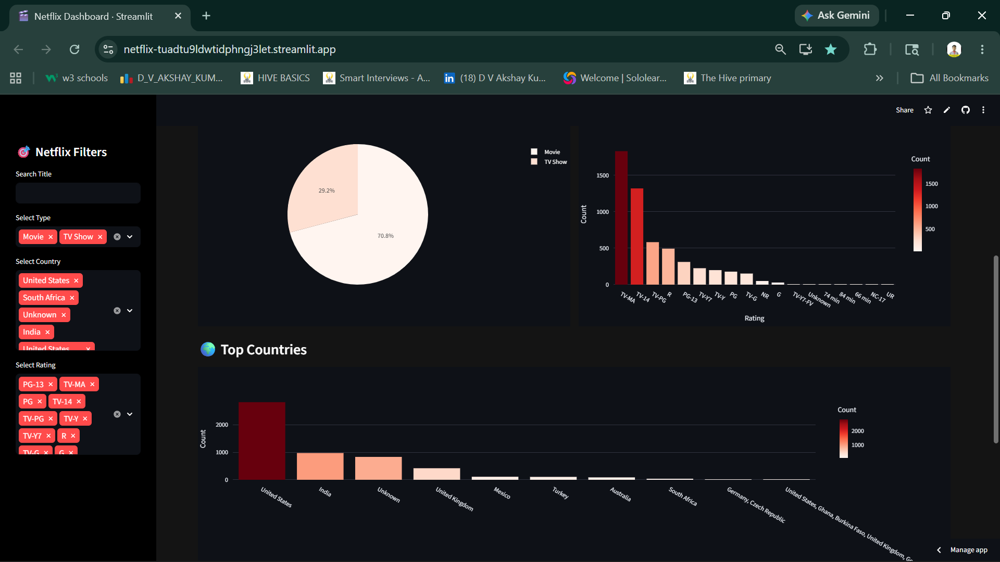

# Netflix Analytics & Recommendation System

An interactive Netflix Data Analytics and Machine Learning Recommendation System built using Python, Streamlit, Pandas, Plotly, and Scikit-learn.

## Live Demo

🌐 Live App: https://netflix-tuadtu9ldwtidphngj3let.streamlit.app/

---

# Features

1. Interactive Netflix Dashboard
2. Search Movies & TV Shows
3. Dynamic Filters
4. KPI Metrics
5. Ratings Analysis
6. Country-wise Analysis
7. Machine Learning Recommendation System
8. Netflix-style Dark UI
9. Interactive Charts & Visualizations

---

# Machine Learning Used

This project uses a **Content-Based Recommendation System** powered by:

* TF-IDF Vectorization
* Cosine Similarity
* Natural Language Processing (NLP)

The system recommends similar Netflix content based on:

* Genres
* Metadata
* Descriptions

---

# Tech Stack

* Python
* Pandas
* NumPy
* Plotly
* Streamlit
* Scikit-learn
* Git & GitHub

---

# Dashboard Sections

* Movies vs TV Shows
* Ratings Distribution
* Top Countries
* KPI Cards
* Search Functionality
* Recommendation Engine

---

# Screenshots
## Screenshots

### Dashboard Home


---

### Recommendation System


---

### Analytics Charts


---

# Installation

```bash
git clone https://github.com/dvakshay/netflix.git

cd netflix

pip install -r requirements.txt

streamlit run app.py
```

---

# Author

D V Akshay Kumar
